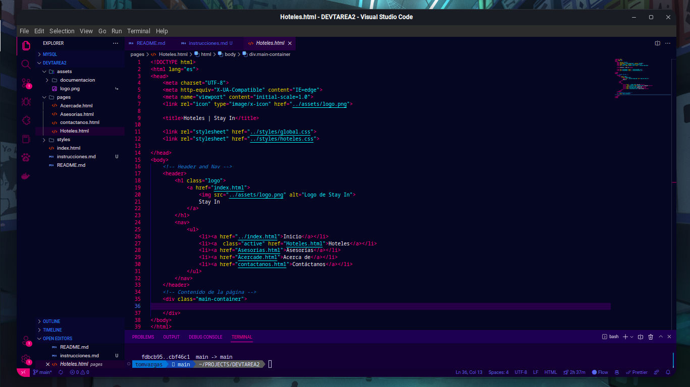

# Cómo editar tu parte
Debes tener en cuenta estas instrucciones para editar tu parte

## Repartición de temas
* **Vargas Tomás:** Home (Index.html) -  Correcciones y revisiones
* **Alvarez Pedro:** Hoteles (pages/Hoteles.html)
* **Campuzano Erick:** Asesorías (pages/Asesorias.html)
* **Ceme Jeremy:** Contáctanos (pages/contactanos.html) - Acerca de (Acercade.html)

## Edición
### Página (HTML)

Esta es la estructura general de todas las páginas, todo el contenido que vayan a hacer debe estar dentro de la etiqueta div con la clase **main-container**

**RECOMENDACIONES**
* Utiliza Clases, Id, elementos requeridos por la asignación, etc.
* Toma referencias de páginas similares
* Manda al grupo de whatsapp capturas de tus referencias para discutirlo antes de hacer cada página
* No uses el atributo style en las etiquetas para dar estilo, usa las hojas css ubicadas en la carpeta **styles** ya todo está configurado.

### Estilos (CSS)
En la carpeta **styles** encontrarán una hoja para cáda página podrán agregar todos los estilos que quieran, existe una hoja de estilos llamada **global.css** que no debe ser modificada ya que contiene estilos generales de la estructura.

